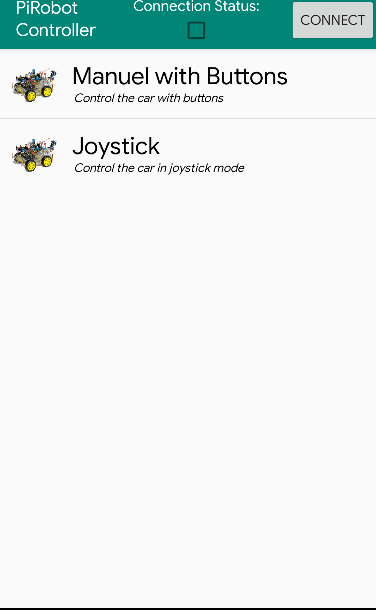
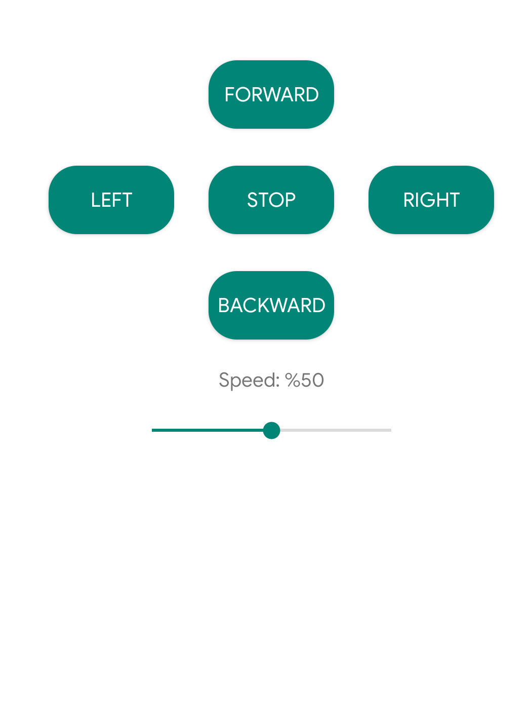
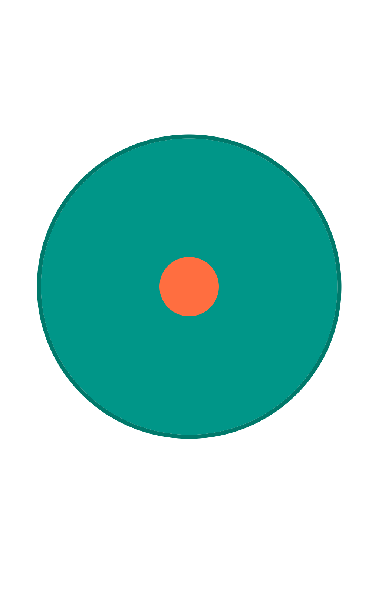

# PiRobotAndroidController
PiRobot Raspberry Pi Robot Android Controller Application/Uygulaması

## Images / Resimler 

* Bu PiRobot projesinin android kısmıdır.
* Raspberry Pi kısmı ve açıklama için diğer repoya

https://github.com/srknzl/PiRobot

* This is the android part of PiRobot project
* For Raspberry Pi part and explanation go to other repo  

https://github.com/srknzl/PiRobot
